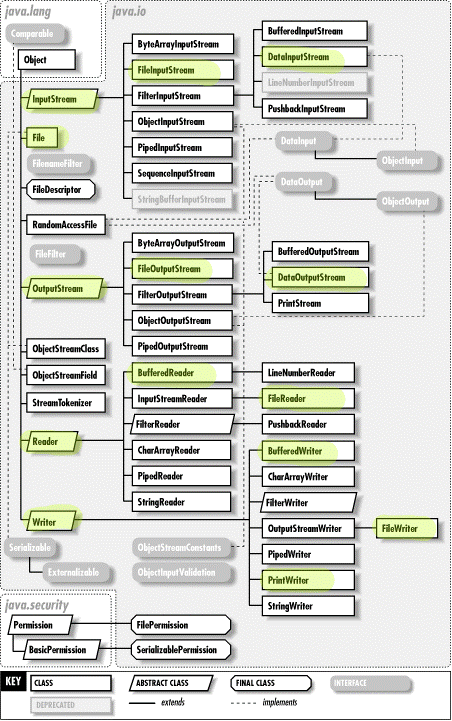

# FICHEROS

<!-- TOC -->
* [FICHEROS](#ficheros)
  * [INTRODUCCIÓN](#introducción)
    * [CLASE FILE](#clase-file)
  * [LEER Y ESCRIBIR](#leer-y-escribir)
    * [FileWriter y FileReader](#filewriter-y-filereader)
    * [PrintWriter y Scanner](#printwriter-y-scanner)
    * [BufferedWriter y BufferedReader](#bufferedwriter-y-bufferedreader)
    * [InputStream y OutputStream](#inputstream-y-outputstream)
  * [SERIALIZACIÓN Y DESERIALIZACIÓN](#serialización-y-deserialización)
    * [Implementación de la interfaz Serializable](#implementación-de-la-interfaz-serializable)
    * [ObjectOutputStream y ObjectInputStream](#objectoutputstream-y-objectinputstream-)
    * [Vulnerabilidades que puede causar la deserialización](#vulnerabilidades-que-puede-causar-la-deserialización)
<!-- TOC -->

La teoría de este tema se va a trabajar a partir de los apuntes:
- [profesor Eduard Silvestre](../../resources/documents/tv10_fitxers.pdf)
- los videos de AULA EN LA NUBE

## INTRODUCCIÓN

Librerías que permiten la gestión de ficheros

[AULA EN LA NUBE](https://www.youtube.com/watch?v=VjU_B45Chbw&list=PLG1qdjD__qH6ULjW5iN8E45m5nkaCNbUu&index=173)

### CLASE FILE

[AULA EN LA NUBE](https://www.youtube.com/watch?v=2GjrBo2SRP8&list=PLG1qdjD__qH6ULjW5iN8E45m5nkaCNbUu&index=174)

[Ver clase en Oracle](https://docs.oracle.com/en/java/javase/17/docs/api/java.base/java/io/File.html)

## LEER Y ESCRIBIR

A continuación se muestra un gráfico con las interfaces e implementaciones de la libreria java.io. Marcadas en color 
las que vamos a ver a lo largo de esta unidad:



### FileWriter y FileReader

[AULA EN LA NUBE](https://www.youtube.com/watch?v=iuRM-VRgOEM&list=PLG1qdjD__qH6ULjW5iN8E45m5nkaCNbUu&index=176)

### PrintWriter y Scanner

[AULA EN LA NUBE](https://www.youtube.com/watch?v=ajcnc2O4f_A&list=PLG1qdjD__qH6ULjW5iN8E45m5nkaCNbUu&index=176)

### BufferedWriter y BufferedReader

[AULA EN LA NUBE](https://www.youtube.com/watch?v=LeLR8C8FsUE&list=PLG1qdjD__qH6ULjW5iN8E45m5nkaCNbUu&index=178)

### InputStream y OutputStream

[AULA EN LA NUBE](https://www.youtube.com/watch?v=ov2EoNfxIdA&list=PLG1qdjD__qH6ULjW5iN8E45m5nkaCNbUu&index=179)

## SERIALIZACIÓN Y DESERIALIZACIÓN

[AULA EN LA NUBE](https://www.youtube.com/watch?v=p2zgGu4nOCc&list=PLG1qdjD__qH6ULjW5iN8E45m5nkaCNbUu&index=182)

La serialización es un proceso que convierte un objeto en una secuencia de bytes, lo que permite guardar el 
estado de un objeto en un archivo o transmitirlo a través de la red, y luego reconstruir el objeto original a partir de esos bytes. Esto es útil cuando necesitas almacenar objetos complejos en disco o enviarlos a través de una red.

Para serializar un objeto:

### Implementación de la interfaz Serializable

Para que un objeto en Java pueda ser serializado, su clase debe implementar la interfaz `Serializable`. Esta 
interfaz no tiene métodos que implementar; sirve simplemente como una marca para indicar que la clase puede ser serializada.

```java
import java.io.Serializable;

public class MiClase implements Serializable {
    // Atributos, métodos, etc.
}
```

Cuando implementas la interfaz, la clase debe llevar asociado un `serialVersionUID`.

El `serialVersionUID` es un campo especial que se utiliza para controlar la compatibilidad de versiones entre la 
clase que se serializa (emisor) y la clase que se deserializa (receptor).

A tener en cuenta:

1. **Generación automática**: Si no proporcionas explícitamente un `serialVersionUID` en tu clase serializable, Java 
   generará uno automáticamente utilizando un algoritmo basado en las características de la clase, como su nombre, 
   sus campos y sus métodos. Sin embargo, no suele ser una práctica recomendable,  ya que la generación automática es 
   muy sensible y cualquier minima modificación de la clase, después de haber serializado objetos, puede hacer 
   cambiar el `serialVersionUID` generado automáticamente, lo que acaba generando problemas de compatibilidad.

2. **Declaración explícita**: Para tener un mayor control sobre la compatibilidad de versiones, es recomendable 
   declarar el `serialVersionUID` explícitamente en la clase.  Se tienen que declarar static (estático), final (final) y de tipo long:

    ```java
    private static final long serialVersionUID = 123456789L;
    ```

   Es importante que este valor sea único para cada versión de la clase. Si modificas la clase de alguna manera que afecte la compatibilidad de versiones (como agregar o eliminar campos), debes actualizar manualmente el `serialVersionUID` para reflejar estos cambios.

3. **Compatibilidad de versiones**: Cuando deserializas un objeto, Java compara el `serialVersionUID` del objeto 
   serializado con el `serialVersionUID` de la clase en tiempo de ejecución. Si estos valores no coinciden, se lanza una excepción `InvalidClassException`, indicando que la deserialización no puede tener éxito debido a la diferencia de versiones.
4. **Autogeneración con el IDE**: Puedes relegar la tarea de la creación de este valor al IDE, ya que la 
   mayoría de ellos permiten su generación aleatoria.

   [Activar generación de "serialversionuid" en Intellij](https://intellij-support.jetbrains.com/hc/en-us/community/posts/14718197525906-intellij-serialversionuid-generate#:~:text=Intellij%20IDEA%20Settings,new%20serialVersionUID%20is%20auto%2Dgenerated)

__Ejemplo de uso de serialización y serialVersionUID__
Imaginemos que tenemos que guardar el estado de una partida de un juego. Serializaremos todos los objetos
relacionados, con el estado en ese momento, en un archivo, por ejemplo .dat.
Lo guardamos serializado utilizando una clase compilada en Windows Vista de 32 bits con JDK 1.6 u32.
Imaginemos que más tarde lo leemos desde un equipo Ubuntu 14 de 64 bits con JDK 1.8 u45 donde la misma
clase ha sido recompilada. Al existir la diferencia de sistema operativo, Java utilizará el valor serialVersionUID
comprobando que el objeto a deserializar es compatible con la clase cargada en la ejecución del programa.
En caso de que la clase hubiese cambiado en Ubuntu al recompilarse, al intentar deserializar un objeto cuya versión
no es la última de la clase a la que corresponde, hubiese fallado.

Puede que no nos interese serializar todos los campos de una clase, en ese caso tendremos que marcarlo como `transient`.

```java
private transient int edad;
```

Los atributos no serializados, al deserializarlos, se inicializan con sus valores por defecto.

### ObjectOutputStream y ObjectInputStream 

Realizar la serialización y la deserialización de objetos.

__DEMO 1__
Vamos a guardar un objeto serializado. Imaginemos que son los territorios y recursos que tiene un jugador en cierto 
momento.
Estos territorios y recursos se guardan como __String__ en un objeto, que se puede serializar.
[Demo 1](serializacion/GestionEstado.java)

__DEMO 2__
Imaginemos que obtenemos el estado del demo anterior, pero para recuperar el estado, la clase ha cambiado y por lo 
tanto, su serialVersionUID
[Demo 2](serializacion_demo2/GestionEstado.java)

__DEMO 3__
Imaginemos en el ejemplo anterior que los territorios y recursos, son otros objetos en lugar de Strings. En ese caso 
es necesario que las subclases también sean serializables. 
[Demo 3](serializacion_demo3/GestionEstado.java)

__DEMO 4__
Imaginemos que lo que necesitamos guardar es una lista de objetos.
[Demo 4](serializacion_demo4/GestionEstado.java)


### Vulnerabilidades que puede causar la deserialización

El siguiente sitio web nos ofrece ejemplos muy interesantes [mkyong.com](https://mkyong.com/java/java-serialization-examples/#deserialization-of-untrusted-data)
